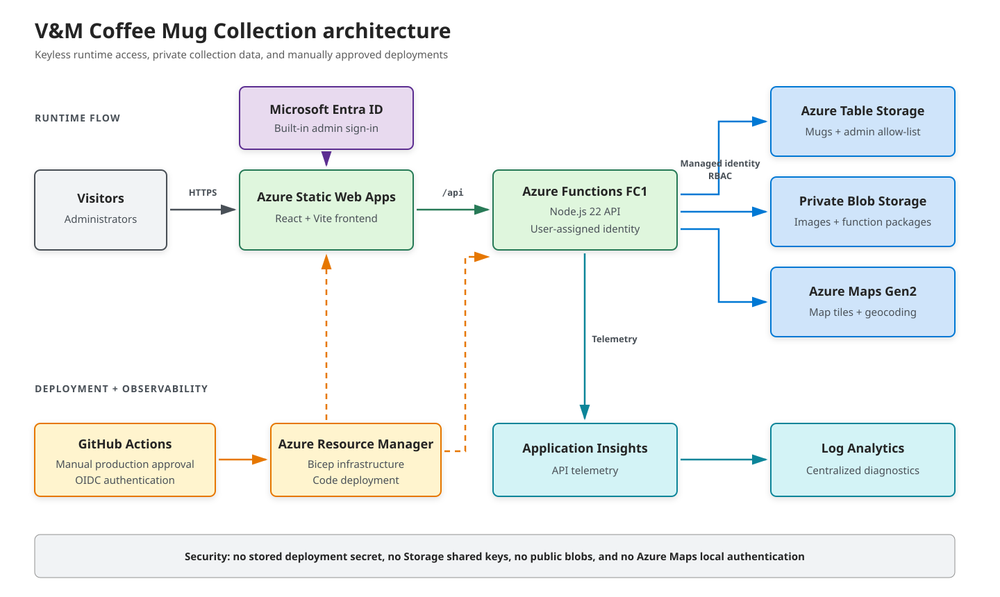

# V&M Coffee Mug Collection

An independent public archive for a personal coffee mug collection. Visitors can browse and map mugs without signing in. Administrators authenticate with a Microsoft account to manage mugs, images, and the administrator allow-list.

This project is unofficial and is not affiliated with or endorsed by any coffee company or trademark owner.

## Architecture

- React, Vite, and TypeScript frontend on Azure Static Web Apps Standard
- Node.js 22 Azure Functions API on Flex Consumption FC1
- Private Azure Blob Storage for mug images and Function deployment packages
- Azure Table Storage for mugs and the administrator allow-list
- Azure Maps Gen2, accessed through the API with managed identity
- Application Insights backed by Log Analytics
- GitHub Actions deployment authenticated to Azure with OIDC

Storage shared keys, public blob access, and Azure Maps local authentication are disabled. The Function App uses a user-assigned managed identity for Blob, Table, Queue, and Maps data access. The linked Function App is the Static Web App API backend.

## Contributing

Contributions are welcome. Open an issue to discuss an idea or bug, or submit a pull request with a focused change. Before opening a pull request, follow the local setup instructions and run the validation commands in the [project reference](docs/PROJECT-REFERENCE.md). Please do not include mug records, uploaded images, credentials, deployment outputs, or other private runtime data.

## Documentation

- [Project reference](docs/PROJECT-REFERENCE.md): local development, validation, Azure setup, deployment, administration, and data handling
- [Deployment guide](DEPLOYMENT.md): detailed first-time production setup and release procedures
- [License](LICENSE) and [third-party notices](THIRD-PARTY-NOTICES.txt)
